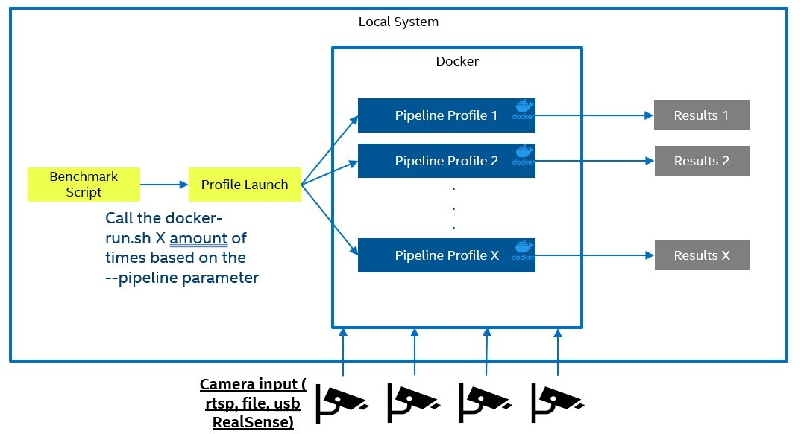

# Performance Benchmarking

<!--ts-->

- [Status](#status)
- [Decision](#decision)
- [Context](#context)
- [Proposed Design](#proposed-design)
- [Consequences](#consequences)
- [References](#references)

<!--te-->

## Decision

<!-- Requirements approval board will update this section with justification for approval or rejection -->

## Context  

<!-- Please provide context to the requirement. -->

To assist customers we will provide a set of performance Docker containers to measure the performance of their pipelines. The performance Docker containers will need to be supported on most modern Intel HW. The output will also need to be formatted and presented to customers as a hardware recommendation.

## Proposed Design 

<!-- Please provide a high level design of the proposed requirement. -->

### Benchmark Script

The benchmark script is designed to help determine the performance needs for a specific pipeline profile. The script will run a designated pipeline profile and can either replicate that pipeline profile a specific number of times or continue to replicate until a performance target is reached.

### Performance tools
sysstat: System CPU utilization
free: System memory usage
iotop: System Disk read and write data
igt-gpu-tools: Integrated GPU utilization
Intel XPU Manage: Discrete GPU utilization
Intel Performance Counter Monitor: System power usage

### Input Source Types

For performance inputs we support RTSP video streams, USB camera, Intel® RealSense™ Camera, and video files. For longer benchmarking runs it's recommended to use a video loop with an RTSP stream for inference result consistency. As an option a RTSP [Camera Simulator](https://intel-retail.github.io/automated-self-checkout/run_camera_simulator.html) is provided with the performance script.

[Input Source Types](https://intel-retail.github.io/automated-self-checkout/pipelinebenchmarking.html#input-source-type)


#### Specified Number of Pipelines

If you are looking to test a specific number of pipelines on different hardware SKUs the `--pipelines` parameter can be used. This parameter will start the specified number of pipelines 

[Specified Number of Pipelines](https://intel-retail.github.io/automated-self-checkout/pipelinebenchmarking.html#benchmark-specified-number-of-pipelines)

[](./images/num-of-pipelines.jpg)

#### Consolidated Results

To make reading results easier a consolidation script has been provided. This script will work with a single or multiple runs of the specified number of pipelines. Details about this process are found in [Benchmark Specified Number of Pipelines](https://intel-retail.github.io/automated-self-checkout/pipelinebenchmarking.html#benchmark-specified-number-of-pipelines)

``` bash
make consolidate ROOT_DIRECTORY=<output dir>
```

#### Stream Density

The stream density parameter can be used to find the maximum number of pipelines at a target frames per second (FPS) on a specific hardware SKU. By setting the `--stream_density` parameter to the desired FPS the script will continue to create pipelines until the average pipelines FPS falls below the desired FPS. The scrip will provide a detailed log to show each pipeline FPS during the test run. This option provides a method for testing the top performance when introducing a new pipeline or hardware SKU.

[Stream Density](https://intel-retail.github.io/automated-self-checkout/pipelinebenchmarking.html#benchmark-stream-density)

[](./images/stream-density.jpg)

## Applicable Repos

[automated-self-checkout](https://github.com/intel-retail/automated-self-checkout)

## Consequences

<!-- Please provide a description of what consequences this requirement will have on the project. This includes breaking and non-breaking changes to all microservices -->

Having a generic and scalable set of performance Docker containers will allow customers to test a wide range of pipelines and hardware setups without extensive configuration of their systems. The flexibility will bring faster time to market and better hardware decision making by customers.

## References

<!-- [link](requirements-review-process.md) - useful links for the design -->
[Pipeline Benchmarking](https://intel-retail.github.io/automated-self-checkout/pipelinebenchmarking.html)