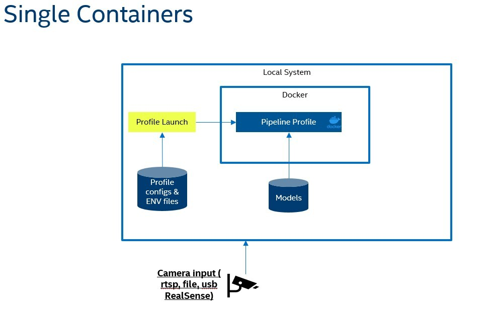

# Distributed Architecture

<!--ts-->

- [Status](#status)
- [Decision](#decision)
- [Context](#context)
- [Proposed Design](#proposed-design)
- [Consequences](#consequences)
- [References](#references)

<!--te-->

## Decision

<!-- Requirements approval board will update this section with justification for approval or rejection -->

## Context  

<!-- Please provide context to the requirement. -->

Depending on the underlying pipeline architecture you may only require one Docker container or you may require many Docker containers. Specifically OVMS has two methods for running: gRPC which uses remote inference calls from a client to server and Capi which does the inferencing locally. Additionally other methods such as GStreamer are run in a single container. The profiles should be able to accommodate both use cases.

## Proposed Design 

<!-- Please provide a high level design of the proposed requirement. -->

Update the profile to handle an array of configurations. This will allow the user to mix multiple Docker container configurations into a single profile.

### Single Container Profile

The single system solution will launch both the OVMS client and OVMS server on the same system as Docker containers. The local network can be used for communication between the Docker containers. The profile launcher program will load the profile configs and environment variables form a local data volume. The computer vision models will also be located on a local data volume. The models can be downloaded using the provided scripts or manually by the user.

### Multiple Container Profile

The remote serve set will launch the same OVMS client and OVMS server containers but on two different systems. These systems can be on the same network on in remote locations as long as the systems can communicate through the network. This will require additional security or a direct connection from client to server. Similar to the single system the profile launcher will load the profile configs and environment variables from a data volume. In this case the data volume can be a local copy or a remote copy of those files. On the server the computer vision models will be in a data volume. Unlike the profile config and environment files these must be located on the server in a data volume. This is to prevent any unwanted changes to the computer vision model when it is located in a remote location. 

## Applicable Repos

[automated-self-checkout](https://github.com/intel-retail/automated-self-checkout)

## Consequences

<!-- Please provide a description of what consequences this requirement will have on the project. This includes breaking and non-breaking changes to all microservices -->

All profiles will need to be updated to use this new array structure. As a benefit common containers such as the OpenVINO Model Server can be shared between profiles.

## References

<!-- [link](requirements-review-process.md) - useful links for the design -->

https://docs.openvino.ai/2023.0/ovms_what_is_openvino_model_server.html
https://github.com/openvinotoolkit/model_server