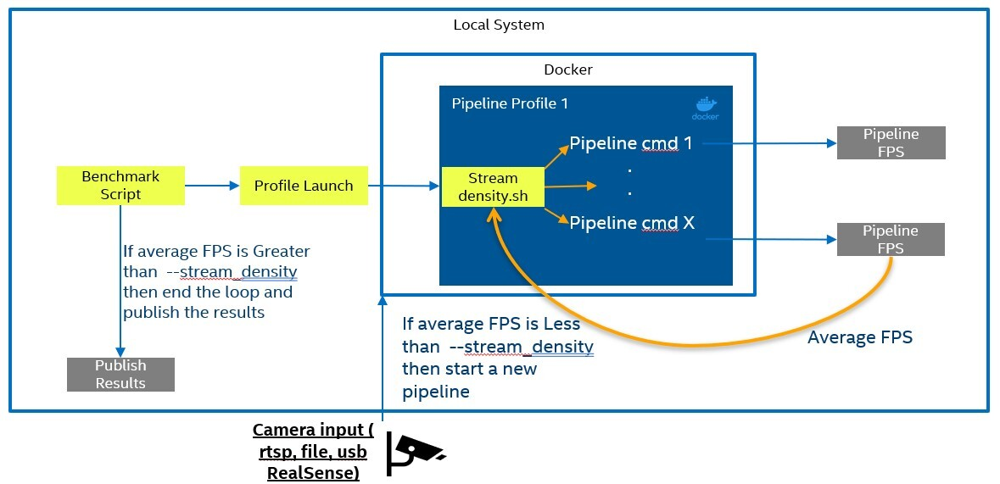

# Distributed Architecture

<!--ts-->

- [Status](#status)
- [Decision](#decision)
- [Context](#context)
- [Proposed Design](#proposed-design)
- [Consequences](#consequences)
- [References](#references)

<!--te-->

## Decision

<!-- Requirements approval board will update this section with justification for approval or rejection -->

## Context  

<!-- Please provide context to the requirement. -->

Yolov8 is the latest release of the popular yolo object detection models. To help support future customer use cases we need to include yolov8 to our growing list of profiles. The efficientnet classification model will be used to help validate the performance and accuracy of the new yolov8 profile.

## Proposed Design 

<!-- Please provide a high level design of the proposed requirement. -->

The yolov8 + efficientnet profile will follow a similar custom pipeline as the previously implemented yolov5 + efficientnet profile. The same gstreamer decoding will be used for the input stream. C-API will send the frames to the OpenVINO Model Server(OVMS) processing through the custom pipeline defined in the config.json. OVMS will output the object bounding boxes along with the object classification. The profile will also output the processing latency in Frames Per Second (FPS).

## Applicable Repos

[automated-self-checkout](https://github.com/intel-retail/automated-self-checkout)

## Consequences

<!-- Please provide a description of what consequences this requirement will have on the project. This includes breaking and non-breaking changes to all microservices -->

The new profile will be isolated to the yolov8 pipeline and have minial impact to the other profiles.

## References

<!-- [link](requirements-review-process.md) - useful links for the design -->

https://docs.openvino.ai/2023.0/ovms_what_is_openvino_model_server.html
https://github.com/openvinotoolkit/model_server